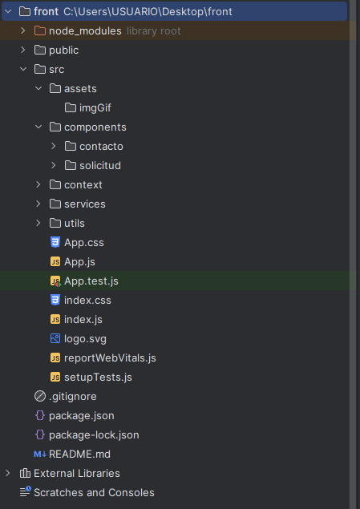
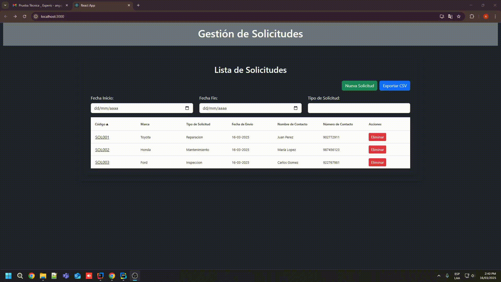
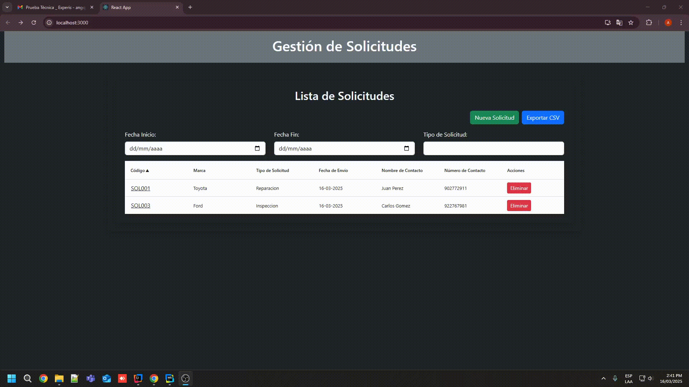

# 📚 Gestión de Solicitudes Frontend

## Descripción del Proyecto

El proyecto **Gestión de Solicitudes** es una aplicación web diseñada para gestionar solicitudes y contactos. Incluye funcionalidades como agregar, eliminar y listar solicitudes y contactos.

---

## 🛠️ Tecnologías Utilizadas

- **Framework:** React 19.0.0
- **Estilos:** Bootstrap 5.3.3
- **Editor Recomendado:** Visual Studio Code o WebStorm

---

## 🚀 Pasos para Ejecutar el Proyecto

#### **Requisitos Previos**
- **Node.js y NPM** instalado.

#### **Instrucciones**

1. Clona el repositorio:
   ```bash
   git clone https://github.com/AngeloQP/gestion-solicitudes-frontend.git

2. Instala las dependencias:
   ```bash
   npm install

3. Ejecuta el proyecto en modo desarrollo:
   ```bash
   npm start

5. Accede a la aplicación en el navegador:

   - **URL:** ([http://localhost:3000](http://localhost:3000/))


## 📁 Estructura del Proyecto





## 📸 Capturas de Pantalla

### **Lista de Solicitudes**


### **Información de Solicitudes**


### **Exportar CSV**


### **Registro de Solicitudes**

